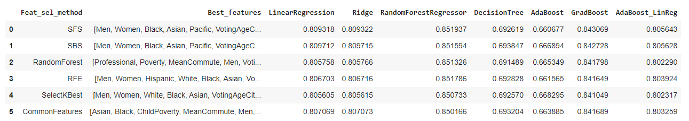

# Project - Income Predictions from US Census Data

---

## Background

The American Community Survey (ACS) helps local officials, community leaders, and businesses understand the changes taking place in their communities. It is the premier source for detailed population and housing information about our nation.

---

## Objectives

Predict the average Income for a community based on the demograpics data from the tables DP03 and DP05, which are a part of the ACS

---

## Scope

For this analysis I will be using the data for the year 2017, which can be accessed at [link](https://data.census.gov/cedsci/table?d=ACS%205-Year%20Estimates%20Data%20Profiles&tid=ACSDP5Y2017.DP03&hidePreview=true)

The Economic Characteristics selected for this analysis are:

>*  Ethnicity
>*  Income and Poverty
>*  Employment by Industry, for e.g. professional, construction, manufacturing, etc. 
>*  Nature of worker, for e.g., private wage and salary, Goverment workers, self-employed, etc.

The subset of this data has been published on Kaggle at [link](https://www.kaggle.com/muonneutrino/us-census-demographic-data?select=acs2017_census_tract_data.csv)

This csv will be the data used for analysis

---

## Solution Approach

The approach will cover the following broad categories:

1. Importing the data
2. Data Analysis and Visualizations
3. Data Cleaning, Data Manipulation and Imputation
4. Data Transformations
5. Feature Engineering
6. Model Selection
7. Model Evaluation and performance metrics
8. Observations, Conclusion and scope of improvement

---

## Solution

**File:** [income_prediction_2017.ipynb](Overview-Income-prediction.ipynb) 

A brief description of the activities undertaken in solution approach mentioned in the previous section

### 1. Importing the data

The data stored in the CSV file [link](acs2017_census_tract_data.csv) was imported into a pandas dataframe. No index columns were set while importing the data

### 2. Data Analysis and Visualizations

A brief analysis was done to understand the meaning and the values contained in the various columns. 
Based on the understanding, the columns were grouped into categories. 

The columns which are redundant, or which do not have any significance towards Income predictions were identified for deletion during the Data Manipulation phase

**Missing Values analysis:**
While the data contained a lot of records which had missing values, there were 696 records which had missing values in most of the columns.

>   

The records which have missing values in most of the fields were marked for deletion in the Data Cleaning and Manipulation phase

### 3. Data Cleaning, Data Manipulation and Imputation

The records which were conatining missing values in most of the fields were deleted.

The redundant columns which were identified in Data Analysis step were deleted.

The fields containing percentage values were converted to whole numbers corresponding to the total population.

There were still some missing vaues in the data. These values were imputed using the K-Nearest Neighbours Imputer

### 4. Data Transformations

**Outliers Analysis and Transformation:**
The data was normalised using a Standard Scalar and the normalised distribution were plotted corresponding the IQR values

>   

Since most of the columns had outliers, Quantile transformation is better suited for the data instead of standard scaling.

Distribution of data after Quantile transformations

>   

### 5. Feature Engineering

Plotting the correlation heatmap of the transformed data

>   

There are a few fields which have high coorrelation with them, which can be transformed. I will do those transformations in the next part of the project

I have followed the following Feature Selection techniques to reduce the number of input variables to both reduce the computational cost of modeling and, in some cases, to improve the performance of the model.

*   Sequential Forward Selection
*   Sequential Backward Selection
*   Random Forest Regressor (baseline config) and obtaining the feature importances
*   Recursive Feature Elimination
*   SelectKBest
*   Common variables from the above methods

After trying out multiple iterations, it was determined that using 20 features instead of the original 29, were providing the optimal performance vs computional cost

Based on the features selected by each of the Feature Selection technique, I prepared a matrix as shown below

>   

### 6. Model Selection

The process of Model Selection comprises of 2 steps

1.  cross_val_score on the best features selected by the Feature Selection process, and baseline config for the following models
2.  HyperParameter Opimization of the models which gave the best outcomes in the first step

**Step1: Cross Validation scores**

Using this matrix prepared from feature selection step, I ran the Model selection process, using the following models

*   LinearRegression
*   Ridge Regressor
*   RandomForestRegressor
*   DecisionTreeRegressor
*   AdaBoostRegressor
*   GradientBoostingRegressor
*   AdaBoostRegressor with LinearResgressor as base estimator

**cross_val_score Outcomes**

>   
>   

From the results we can conclude that the features list obtained from *Sequential Forward Selection* and the models *Random Forest Regressor* and *Gradient Boosting Regressor* provided with the best R2 values.

These will be used in the next step of HyperParameter Opimization of the machine learning model

**Step2: Hyperparameter Optimization**

I have used [sklearn.model_selection.GridSearchCV](https://scikit-learn.org/stable/modules/generated/sklearn.model_selection.GridSearchCV.html?highlight=gridsearchcv#sklearn.model_selection.GridSearchCV) provided by the sklearn library to perform grid search.

From the outcomes of the cross validation step, the RandomForestRegressor and GradientBoostingRegressor models gave the best outcomes of 85.19% and 84.3% respectively.

#### Grid Search with RandomForestRegressor

*Attemp1:*

Param_name| Param_values
---|---
n_estimators|[1000, 1200]
max_depth|[80, 90 , 100]
warm_start|[True]
max_samples|[0.2, 0.3]
max_features|['auto', 'sqrt']

Best Model config: *Not run yet*

Best Score: *Not run yet*

#### Grid Search with GradientBoostingRegressor

*Attemp 1:*

>   

*Attempt 2:*

>   

*Attempt 3:*

>   

#### Grid Search with AdaBoostRegressor

*Attempt 1*

>   

### 7. Model Evaluation and performance metrics

**Not Run Yet**

The model configuration that gives the best outcomes during the Model Selection process will be used as our final model. 

I will create a pipeline with the following steps:

1.  QuantileTransformer to be run on the features list selected using the SFS method
2.  PCA decomposition - *TBD*
3.  Model Selected from Hyperparameter Optimization step, with the best parameters

I will split the dataset in training and testing in the 80:20

After that I will fit the pipeline with the training data and test it with the testing data.

### 8. Observations, Conclusion and scope of improvement

**Not Run Yet**

---